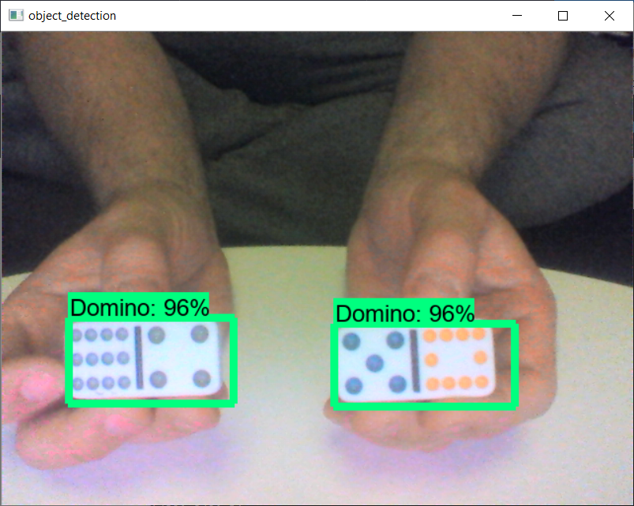

# Domino Object Detection

To create my object detection model, i used following tutorials from Gilbert Tanner:

1. [Installing the Tensorflow Object Detection API](https://gilberttanner.com/blog/installing-the-tensorflow-object-detection-api)
2. [Live Object Detection with the Tensorflow Object Detection API](https://gilberttanner.com/blog/live-object-detection)
3. [Creating your own object detector with the Tensorflow Object Detection API](https://gilberttanner.com/blog/creating-your-own-objectdetector)

Thanks for the nice tutorials.

Using Tensorflow 2, I run in some issues to run the training

`AttributeError: module 'tensorflow' has no attribute 'contrib'`

## Dockerfile

Therefore I created a [Dockerfile](./Dockerfile) to install and run the training procedure.

First, create the docker image using:

`docker build -t tensorflow-git .`

Then run bash into docker using:

`docker run -it -v <my_git_path>:/my_git_path tensorflow-git bash`

Change the directory:

`cd /my_git_path/`

## Training

Run the training procedure:

`python model_main.py --logtostderr --model_dir=training/ --pipeline_config_path=training/faster_rcnn_inception_v2_pets.config`

During the training, you can open the Tensorboard:

`tensorboard --logdir=training`

## Export and run Object Detection

To export the inference graph, type:

`python /tensorflow/models/research/object_detection/export_inference_graph.py --input_type image_tensor --pipeline_config_path /my_git_path/training/faster_rcnn_inception_v2_pets.config --trained_checkpoint_prefix /my_git_path/training/model.ckpt-XXXX --output_directory /my_git_path/inference_graph`

Finally, run the object detection with your trained model:

`python object_detection_demo.py`